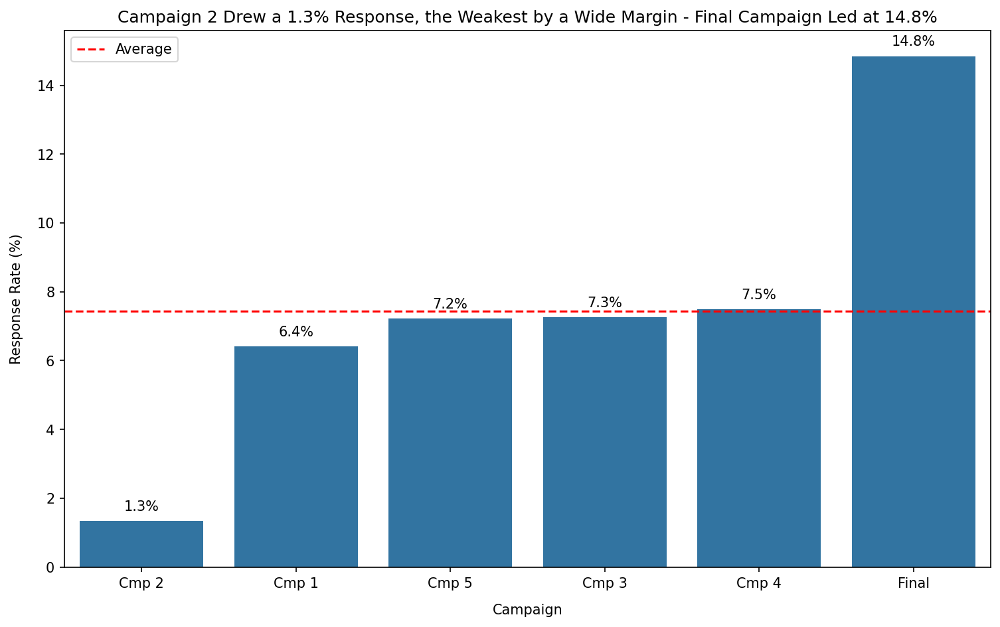
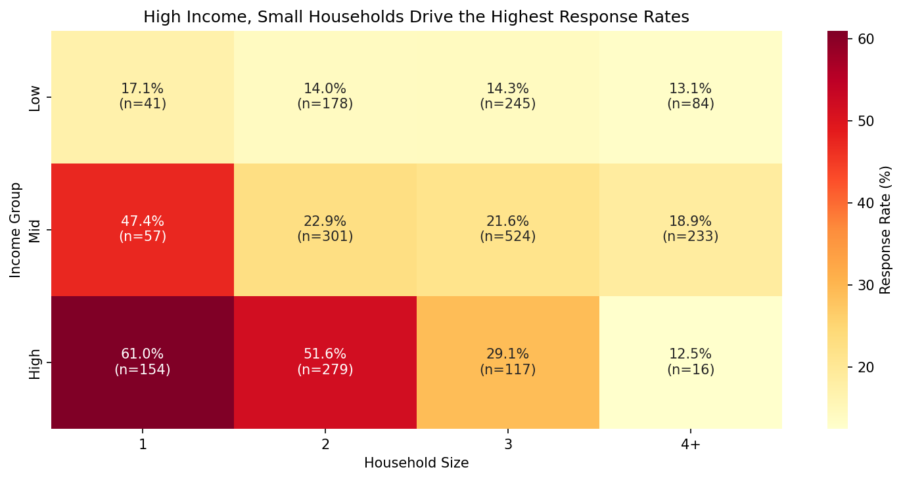
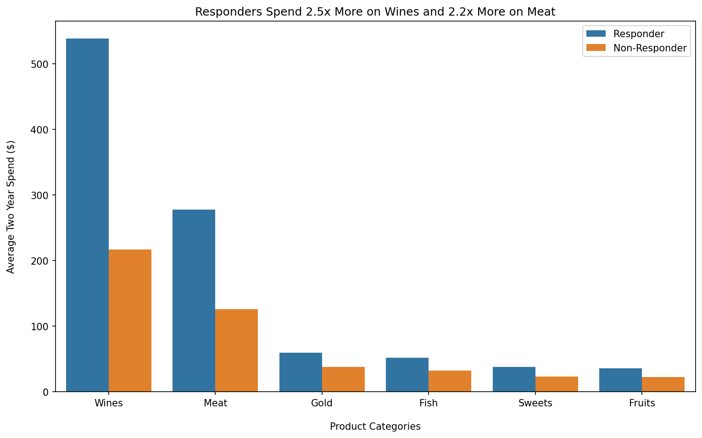

# CMO Marketing Audit

A marketing audit of six campaigns across 2,229 retail customers, identifying where 
campaign effort pays off, where it is likely wasted, and what to change.

**[View the full notebook →](cmo-audit.ipynb)**

## Verdict

The strongest results come from one campaign and one type of customer: high income 
customers in small households. Campaign 2 barely registered a response, and catalog 
effort aimed at low income customers is likely wasted, since they rarely buy through it.

## Dataset

[Customer Personality Analysis](https://www.kaggle.com/datasets/imakash3011/customer-personality-analysis) 
from Kaggle, covering 2,240 customers of a retail company between 2012 and 2014. It 
includes demographics, spend across six product categories, purchases by channel (web, 
catalog and store), and each customer's response to six marketing campaigns. After 
cleaning, 2,229 customers were analysed.

Spend figures are two year totals per customer. The dataset does not specify currency; 
amounts are shown in $ for readability.

## Audit Questions

1. Which campaigns delivered acceptable response rates, and which fell short?
2. Which customer segments respond to campaigns, and which rarely do?
3. Which product categories drive the most revenue, and are campaign responders the ones buying them?
4. Which channels does each segment actually buy through?
5. Given all this, how should campaign effort be reallocated?

## Key Findings

**Campaign performance splits sharply.** The final campaign drew a 14.8% response rate, 
twice the 7.4% average. Campaign 2 drew 1.3%, roughly six times below it. The rest sit 
near average.

**Campaign response concentrates in high income, small households.** 48.4% of high 
income customers responded to at least one campaign, against 14.2% of low income 
customers. One person households responded at 50.8%, against 17.1% for households of 
four or more. Combining the two, high income one person households responded at 61.0%. 
Age shows almost no effect.

**Wines and meat drive revenue and separate responders from non-responders.** They make 
up 77% of average spend, and responders outspend non-responders by 2.5x on wines and 
2.2x on meat, against roughly 1.6x in every other category.

**Catalog is mainly a high income channel.** Catalog share rises from 8.7% of low income 
purchases to 29.5% of high income purchases, and falls from 28% to 13% as household 
size grows. Store leads in every segment.

## Recommendation

| Cut | Hold | Shift | Double |
|---|---|---|---|
| Campaign 2 | Campaigns 1, 3, 4, 5 | Marketing to large households, from catalog to web | The final campaign (14.8% response) |
| Catalog effort aimed at low income customers | | | High income, one and two person households |
| | | | Wine and meat led offers |

## Approach

1. **Cleaning.** Dropped constant columns, filled missing income with the median, 
removed impossible birth years, an extreme income outlier and invalid marital status 
entries (2,240 to 2,229 records).
2. **Feature engineering.** Built total spend, campaigns accepted, age, tenure, 
household size, a responder flag, and income, age and household segments. Households 
of five were merged into a 4+ group, since the group held only 32 customers.
3. **Analysis.** Answered four audit questions on campaigns, segments, products and 
channels, each with a chart and a headline finding, plus a joint income and household 
size analysis to test the core targeting claim.
4. **Recommendation.** Synthesised the findings into a cut, hold, shift and double 
reallocation.

## How to Run

1. Download `marketing_campaign.csv` from the 
[Kaggle dataset page](https://www.kaggle.com/datasets/imakash3011/customer-personality-analysis).
2. The notebook's file path is set for Kaggle. To run locally, place the CSV in the 
same folder as the notebook and change the path in the load cell to 
`marketing_campaign.csv`. The file is tab separated, so keep `sep="\t"`.
3. Install the required libraries: `pip install pandas numpy matplotlib seaborn`

## Tools

Python, pandas, NumPy, matplotlib, seaborn, Kaggle Notebooks
